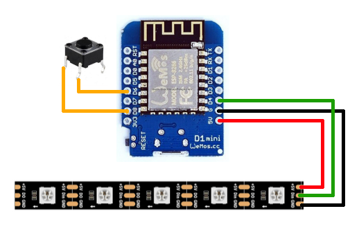

# Freilauf25 – WS2812 LED-Kette für ESP8266

Dieses Projekt steuert eine **WS2812 Neopixel-LED-Kette** über einen **ESP8266 NodeMCU**. Die Firmware ist bereits fertig, sodass du die LEDs direkt zum Blinken bringen kannst. Ein **Taster** kann optional angeschlossen werden, um zwischen den Blinkmodi zu wechseln.

Die Hardware ist bewusst einfach gehalten, sodass Anfänger:innen direkt loslegen können und wurde auf dem Freilauf Camp 2025 in einem Workshop vorgestellt.

---

## Inhalt

- [Was du brauchst](#was-du-brauchst)
- [Hardware anschließen](#hardware-anschließen)
- [GPIOs, Modi und Input/Output](#gpios-modi-und-inputoutput)
- [ESP8266 kaufen](#esp8266-kaufen)
- [Tipps zum Löten](#tipps-zum-löten)
- [Firmware installieren](#firmware-installieren)
- [Automatischer Moduswechsel](#automatischer-moduswechsel) 

---

## Was du brauchst

- ESP8266 NodeMCU (z. B. ESP-12E)
- WS2812 Neopixel-LED-Kette
- Optional: ein kleiner Taster (Pushbutton)
- USB-Kabel für NodeMCU
- USB Powerbank oder Netzteil (5 V)
- Lötausrüstung (Lötkolben, Lötzinn, ggf. Schrumpfschlauch)
- Computer mit **Windows, macOS oder Linux**

---

## Komponenten kaufen

Du kannst die benötigten Komponenten in Elektronikshops oder Online-Shops kaufen. Hier sind einige Links als Beispiele:

- **ESP8266 NodeMCU:** [https://www.amazon.de/dp/B0D7BSC3VC](Amazon)
- **WS2812 Neopixel-LED-Kette:** [https://www.amazon.de/dp/B08Y8QXTCL](Amazon)
- **Taster:** [https://www.amazon.de/-/en/Miniature-Tactile-Momentary-Electronic-Components/dp/B09WVFHMSV](Amazon)
- **USB-Kabel:** [https://www.amazon.de/dp/B073TTTPXD](Amazon)

Wer alternative Links oder Shops kennt, kann diese gerne in Form eines [Pull Requests](https://github.com/zonque/Freilauf25/pulls) hinzufügen.

## Hardware anschließen



**LED-Kette:**
- Data → **D4**
- GND → GND
- 5 V → 5 V (oder externes Netzteil, wenn viele LEDs)

**Optionaler Taster:**
- Ein Pin des Tasters → **D6** → wird bei Tastendruck auf LOW gezogen (Pull-down)
- Anderer Pin des Tasters → GND

> Mit diesem Taster kannst du zwischen den vier Blinkmodi wechseln.

**USB Powerbank:**

Eine Powerbank oder ein 5 V Netzteil versorgt den ESP8266 und die LEDs. Achte darauf, dass die Powerbank genügend Strom liefern kann, besonders bei längeren LED-Ketten.

## Tipps zum Löten

- Achte auf **saubere Lötstellen**: glänzend, nicht bröckelig oder klumpig.
- Vor dem Löten immer **Pins und Kabel verzinnen** (kurz mit Lötzinn benetzen).
- Pass auf die **Polung der LEDs** auf: Datenrichtung beachten.
- Wenn möglich, benutze **Schrumpfschlauch**, um Kurzschlüsse zu vermeiden.

Englischsprachiger Leitfaden zum Löten von Adafruit:
[https://learn.adafruit.com/adafruit-guide-excellent-soldering](https://learn.adafruit.com/adafruit-neopixel-uberguide/assembly)  

---

## VSCode & PlatformIO installieren

1. **Visual Studio Code (VSCode) installieren**  
   - Lade VSCode hier herunter: [https://code.visualstudio.com/](https://code.visualstudio.com/)  
   - Installiere es wie jedes normale Programm.  

2. **PlatformIO IDE als Extension installieren**  
   - Öffne VSCode.  
   - Gehe links auf das **Extensions-Symbol** (Quadrat mit vier Ecken).  
   - Suche nach **"PlatformIO IDE"**.  
   - Klicke auf **Install**.  
   - Nach der Installation startet VSCode eventuell neu.  

3. **PlatformIO starten**  
   - Klicke auf das **PlatformIO-Haus-Symbol** in der linken Sidebar.  
   - Von hier kannst du Projekte öffnen, Firmware kompilieren und auf den ESP8266 hochladen.  

4. **Treiber prüfen**  
   - Stelle sicher, dass dein Computer den NodeMCU über USB erkennt.  
   - Unter Windows ggf. CH340-Treiber installieren: [https://sparks.gogo.co.nz/ch340.html](https://sparks.gogo.co.nz/ch340.html)  

Jetzt bist du bereit, die Firmware hochzuladen!

## Firmware installieren

1. Öffne ein Terminal oder die Kommandozeile.
2. Klone das Repository:  
   ```bash
   git clone https://github.com/zonque/Freilauf25.git
   cd Freilauf25
   ```
3. Öffne das Projekt in VSCode mit PlatformIO oder Arduino IDE (PlatformIO empfohlen).
4. Schließe den ESP8266 per USB an.
5. Klicke auf Upload → die LEDs starten automatisch im Standardmodus.
6. Optional: Taster anschließen → Modi wechseln.

## Automatischer Moduswechsel

Die Firmware wechselt aktuell alle 5 Sekunden automatisch zum nächsten Blinkmodus.
Wenn du den Intervall ändern möchtest, öffne `src/main.cpp`. Die Variable `autoSwitchTimeoutMillis` steuert den Intervall in Millisekunden. Setze sie auf `0`, um den automatischen Wechsel zu deaktivieren oder auf einen anderen Wert, um den Intervall anzupassen.

```cpp
static const int autoSwitchTimeoutMillis = 5000; // 5 Sekunden
```

## GPIOs, Modi und Input/Output

Auf dem ESP8266 wird jeder Pin als **GPIO** (General Purpose Input/Output) bezeichnet.

- **D4:** Output → Steuert die WS2812 LEDs  
- **D6:** Input → Über Pull-Up erkennt die Firmware, wenn der Taster gedrückt wird (Pin LOW)
- **D8:** Output → Referenzspannung für den Taster (Pin LOW)

**Warum Pull-down?**  
- Ein Pin darf niemals „schweben“ (undefinierter Zustand).
- Pull-up sorgt dafür, dass der Pin im Normalzustand HIGH ist.
- Beim Drücken des Tasters wird der Pin auf LOW gezogen.
- So kann die Firmware zuverlässig erkennen, ob der Taster gedrückt wird.

---

## Lizenz

Dieses Projekt ist unter der MIT-Lizenz lizenziert. Du kannst den Code frei verwenden, modifizieren und verteilen, solange du die Lizenzbedingungen einhältst.